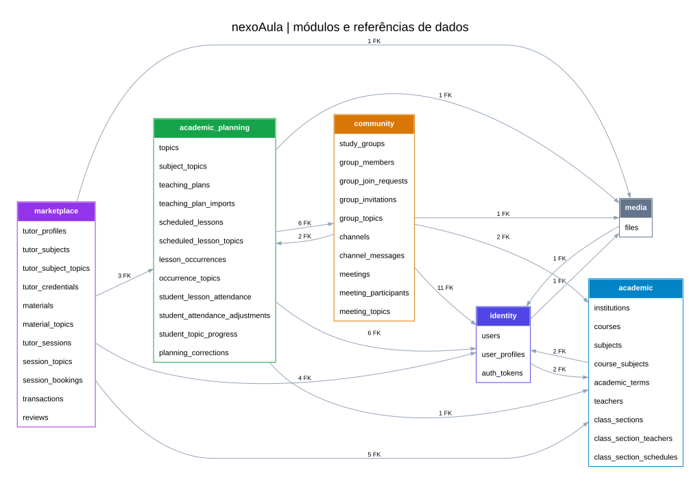

# Diagramas do modelo de dados

Fonte editável: [nexoaula.dbml](nexoaula.dbml). A revisão aceita pelo proprietário está documentada no [guia do modelo](../architecture/data-model.md) e na [#7](https://github.com/Wanjos-eng/nexoaula-webapp/issues/7).

## Visão geral



As setas representam referências de dados, **não dependências permitidas entre repositories**. O número indica quantas FKs cruzam cada par de módulos.

## Detalhes por módulo

- [Identity](generated/identity.svg)
- [Media](generated/media.svg)
- [Academic](generated/academic.svg)
- [Academic Planning](generated/academic_planning.svg)
- [Community](generated/community.svg)
- [Marketplace](generated/marketplace.svg)

Cada detalhe mostra campos/tipos das tabelas do módulo e seus destinos externos de FK. Tabelas externas estão em cinza e mostram apenas campos referenciados. A seta parte da FK para o destino; o tooltip informa as colunas e a ação de exclusão. Referências recebidas aparecem no módulo de origem.

Estes SVGs são um índice visual, não a especificação completa de cardinalidade, nulabilidade, índices, enums e CHECKs. Consulte o DBML para essas regras. O modelo tem 45 tabelas, 102 FKs e 57 CHECKs; ainda não é uma migration nem implementação da aplicação.

## Regenerar e verificar

Da raiz, com Node.js 24:

```sh
npm ci --prefix tools/data-model --ignore-scripts
node scripts/render-data-model.cjs
node scripts/render-data-model.cjs --check
node scripts/validate-data-model.cjs tools/data-model
```

O parser oficial DBML v2 e o Graphviz/WASM geram os SVGs localmente, sem enviar o modelo a um serviço externo. Cada arquivo inclui o hash do DBML e o check detecta divergência. A CI verifica a mesma fonte e lockfile.

Não são capturas do editor dbdiagram.io. Para inspecionar nele, importe manualmente o DBML atual; a imagem antiga anexada ao PR/Notion é histórica e não representa esta revisão.
